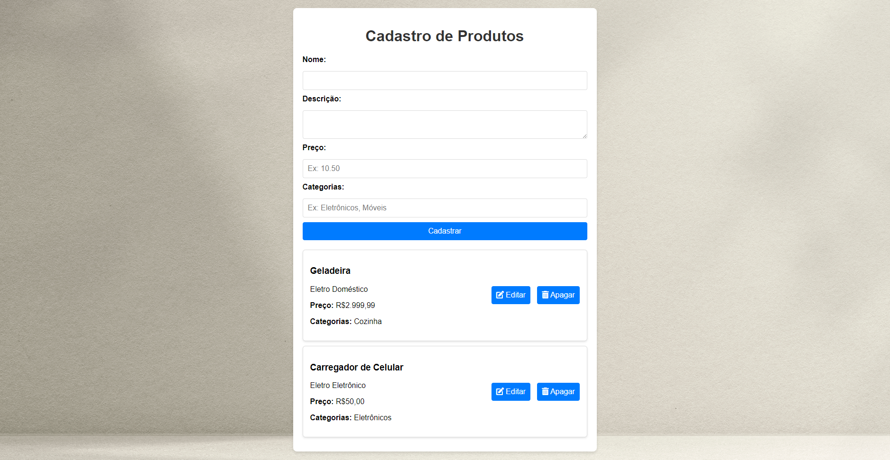

# Cadastro de Produtos 🛒

Este é um projeto/teste simples de página web para cadastro de produtos, desenvolvido com HTML, CSS e JavaScript.

## 📋 Funcionalidades

1. **Formulário de Cadastro**:
   - Coleta informações do produto: **nome**, **descrição**, **preço** e **categorias**.
   - Valida os campos obrigatórios antes de cadastrar.

2. **Exibição de Produtos Cadastrados**:
   - Após o cadastro, os dados do produto são exibidos em forma de **card**.
   - O preço é formatado no padrão brasileiro (R$).

3. **Ações nos Cards**:
   - **Editar**: Permite reabrir os dados do produto no formulário para edição.
   - **Apagar**: Remove o card do produto.

4. **Estilo Responsivo**:
   - Layout visualmente agradável com design responsivo.

## 🚀 Tecnologias Utilizadas

- **HTML**: Estrutura da página.
- **CSS**: Estilização para um design limpo e moderno.
- **JavaScript**: Manipulação do DOM e lógica funcional.

## 📂 Estrutura do Projeto
├── index.html 
Estrutura HTML da página ├── style.css 
Estilos CSS └── script.js 
Lógica e manipulação do DOM

### 📝 Notas
O preço deve ser inserido com reais e centavos (exemplo: 10.50).
Campos obrigatórios precisam ser preenchidos para o cadastro.
Botões de edição e exclusão estão disponíveis nos cards para manipulação dos produtos cadastrados.

### 📸 Prévia do Projeto  

### 🛠️ Melhorias que podem ser Implementadas
Armazenar os produtos cadastrados no LocalStorage para persistência de dados.
Implementar filtros para buscar produtos por categorias ou faixa de preço.
Adicionar suporte para imagens nos produtos.
